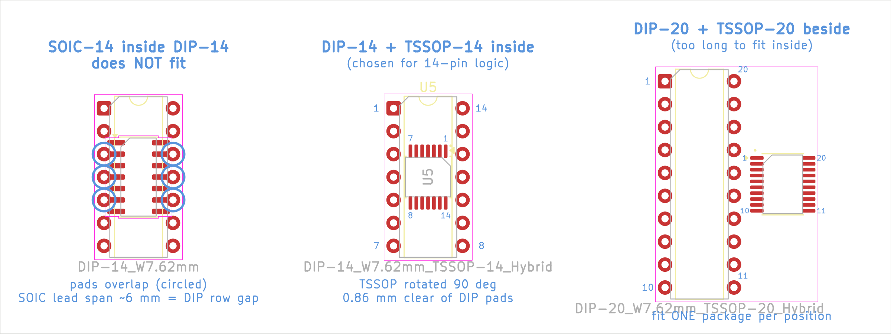

# PicoGUS THT (through-hole) v1.3.0 – based on PicoGUS v1.2

Board revision **v1.3.0**: a through-hole variant of the PicoGUS **v1.2** ISA card, with an added
**Waveblaster (wavetable) daughterboard header** and an **analogue volume
control** that mixes the wavetable output with the PicoGUS audio.

> **Status: prototype design, not yet fabricated or tested.**
> The schematic passes ERC and was netlist-compared against v1.2. The board was
> autorouted and checked with DRC in KiCad 10, but nobody has built one yet.
> Read the [caveats](#caveats) before ordering boards.

Files:

| File | What |
|---|---|
| `PicoGUS-THT.kicad_pro/.kicad_sch/.kicad_pcb` | KiCad **10** project (the root sheet is the v1.2 logic) |
| `audio.kicad_sch` | PCM510x DAC sheet (same circuit as v1.2, with THT passives) |
| `wavetable.kicad_sch` | New: Waveblaster header, WT control logic, WT volume, op-amp mixer, line-out jack |
| `PicoGUS-THT-schematic.pdf` | Schematic PDF |
| `BOM-THT.csv` | BOM with DigiKey **and** LCSC part numbers (stock checked 2026-09-28) |
| `PicoGUS-THT.pretty/` | Board-specific footprints (DIP/TSSOP hybrids, axial/0805 resistor, ferrite and capacitor hybrids) |
| `tools/gen_hybrid_footprints.py` | Generator for the footprints above (run it with KiCad 10's Python) |

The shared `PiGUS library` symbols and footprints are linked from `hw-common/`, like the other boards.

## What changed compared to v1.2

### Through-hole wherever possible

| Part | v1.2 | THT board |
|---|---|---|
| Resistors | 0805 | 1/4 W axial (10.16 mm) **or** 0805 SMD: each resistor footprint has 0805 pads between the axial holes |
| Ceramic caps | 0805 / 1206 | radial MLCC on **5.0 mm** pitch **or** 0805 SMD: 0805 pads between the two holes |
| Electrolytics | 1206 / SMD | 5 mm radial electrolytics |
| D1 | B5819W SOD-123 | 1N5819 DO-41 |
| U2 | 74LVC244 TSSOP-20 | **74AHC244 DIP-20** (TSSOP-20 pads beside it) |
| U5 | 74AHC14 SOIC-14 | **74AHC14 DIP-14** (TSSOP-14 pads inside it) |
| U6 | 74LVC00 SOIC-14 | **74AHC00 DIP-14** (TSSOP-14 pads inside it) |
| U7 | 74LVC1G00 SOT-23-5 | **one gate of a 74AHC00 DIP-14** (TSSOP-14 inside), 3 spare gates tied off |
| U10 | 74LVC2G06 SOT-23-6 (open drain, 3V3) | **74AHCT126 DIP-14 at +5 V** (TSSOP-14 inside), used as a "pseudo open-drain" |
| FB1/FB2 | 0805 beads | 10.16 mm axial footprint with 0805 pads inside (bead, axial bead or wire link) |

Parts that only exist as SMD stay SMD. All of them have a pitch of 0.65 mm or more and can be hand-soldered:

* **U3, U4** SN74CB3T3257: FET bus-switch mux with 5 V→3.3 V clamping. It only comes in
  TSSOP-16/TVSOP. No DIP part does this job without redesigning the ISA bus interface (and the PIO timing).
* **U8** APS6404L PSRAM: SOIC-8.
* **U9** PCM5100A/PCM5101A/PCM5102A DAC: TSSOP-20.

### Hybrid footprints: DIP **or** SMD at each logic position



Each logic IC position has a DIP footprint *and* pads for the SMD version of the same
function and pinout. The pad numbers are identical, and the traces join them. **Fit only one
package per position.**

* 14-pin: a **TSSOP-14 rotated 90° sits inside** the DIP-14 rows. (A SOIC-14 can't: its
  ~6 mm lead span equals the gap between the DIP rows.)
* 20-pin: the TSSOP-20 is too long to fit inside, so it sits **right next to** the DIP-20.

Why: the 3.3 V logic needs 5 V-tolerant inputs (74AHC/74LVC). TI still makes the AHC/AHCT
parts in DIP and DigiKey stocks them, but LCSC has almost no stock of them
(0–74 pcs). LCSC/JLCPCB builders fit the TSSOP, which has plenty of stock. DigiKey builders
fit the DIP, and a mixed "hybrid" build is fine.

### U10: 74AHCT126 instead of 74LVC2G06

The open-drain 74LVC2G06 has no DIP equivalent that takes a 3.3 V input and has a 5 V
open-drain output. HC/LS open-drain parts either need 5 V input levels or float "high"
while the Pico boots, which would hang the ISA bus through IOCHRDY. The AHCT126 runs from +5 V and
accepts the 3.3 V signals (TTL thresholds). It is wired as a pseudo open-drain driver:
input **A is tied to GND**, and the signal that drove the old inverter input now drives **OE**. OE=1 pulls the line low;
OE=0 releases it. The polarity is the same as on v1.2, so **no firmware change** is needed.

* Gate A: IOCHRDY (as v1.2). **R18** (100 k pull-down on `~RI/OCHRDY`) keeps IOCHRDY released
  while +5 V is up but the Pico's 3.3 V rail isn't yet, or while the Pico is in reset.
* Gate B: MIDI-out current loop (as v1.2).
* Gate C: Waveblaster `/RESET`. Gate D: Waveblaster MIDI (see below).
* **Only use 74AHCT126 here** (the DIP SN74AHCT126N or the TSSOP SN74AHCT126PW). A 74**HCT**126 has
  input clamp diodes to VCC: with the Pico powered from USB and the PC off, the Pico's
  outputs would back-power the ISA +5 V rail through it. A 74**HC**126 at 5 V doesn't recognise 3.3 V
  highs. An **AHC**126 would work electrically, but its 5 V thresholds leave no margin.

**R17** (10 k pull-up on `UART_TX`) holds the MIDI and Waveblaster MIDI lines idle while the Pico boots
(the RP2040 pads default to pull-down, which would otherwise send a MIDI "break").

### Waveblaster header (new)

`J9` is the standard 26-pin Waveblaster header (2x13 male, 2.54 mm; the daughterboard has the
female socket). The pinout is as on PicoGUS 2.0: DGND 1,3,5,7,9,11 · AGND 15–25 odd · +5 V 6,10,14 ·
+12 V 18 · −12 V 22 · MIDI to DB 4 · audio R 20 · audio L 24 · /RESET 26 · 2,8,12,13,16 n.c.

* **MIDI** (pin 4): the MPU-401 UART (`UART_TX`, the same data as the MIDI-out jack) through U10D,
  a pseudo open-drain driver with a **10 k pull-up to +3.3 V** (R16). The line swings 0/3.3 V: that is
  a valid TTL high for 5 V daughterboards, and it is safe for modern 3.3 V daughterboards
  (Dreamblaster etc.) that are not 5 V tolerant.
* **/RESET** (pin 26): ISA RESET through U10C, also pseudo open-drain with a 10 k pull-up to +3.3 V (R9).
* **±12 V** come straight from the ISA bus. They are now connected on this board, with 0.1 µF decoupling at J9.
* The footprint includes the standard support hole at the far end of the daughterboard
  (the M3 × 11 mm standoff is in the BOM).

### Analogue WT volume + op-amp mixer (new)

```
                    v1.2 DAC filter
PCM510x OUTL --- 470R ---+--- 10k (R10) ---+-------+---- 100pF (C30) ---+
                         |                 |       +---- 10k (R19) -----+
                       2.2nF               |       |                    |
                         |                 |       +--|- \              |
                        GND                |          |NE5532 >---------+--- 100R (R21) --> LINE OUT L (J8)
WT L (J9.24) -- 10uF (C22) --+-- RV1A --- 10k (R12)   +--|+ /
                             |   10k log   (from wiper)    |
                         100k (R14)                       GND
                             |
                            GND                 (right channel: R11, R13, R20, C31, R22, RV1B, C23, R15)
```

* The two sources are summed by a **NE5532 inverting summer** (U11, DIP-8, powered from ISA ±12 V).
  Both inputs have unity gain, so the PCM line out has the same level as on v1.2 (2.1 Vrms full scale),
  and the WT source is not attenuated by the mixing. The output is phase-inverted, which you can't hear.
* **RV1** (dual-gang 10 k audio taper, Alps RK097 dual, right angle) sets the Waveblaster
  level. Its shaft goes through the ISA bracket above the MIDI jack. The signal is on the
  CW-end terminals (3/6) and GND is on the CCW end (1/4), so the level rises clockwise. The 10 k summing
  resistor loads the wiper only a little, because a log pot's wiper is near the GND end for most of its travel.
* C22/C23 (10 µF, + towards J9) block any DC offset from the daughterboard. R14/R15 (100 k) give the
  capacitors a defined DC level when no daughterboard is fitted. Without a daughterboard, RV1's setting doesn't matter.
* The PCM510x sees a ~10.5 kΩ load (its datasheet minimum is 1 kΩ). The output is DC-coupled, which is fine because the
  DAC's outputs are ground-centred; expect a few mV of offset at the jack.
* R21/R22 (100 Ω) isolate the op-amp from cable capacitance. The NE5532 drives 600 Ω headphones
  easily, but this is still a line output.

### Other changes

* The GY-PCM5102 **module option is removed** (I2S_DAC1/J4 of v1.2; on v1.2, J4 carried
  AGND/ROUT/AGND/LROUT). The Waveblaster mix needs the on-board DAC, and the module's own jack would bypass
  the mixer. The DAC itself stays SMD, as it must.
* The board is **103.7 × 99.9 mm**. It has the same length, ISA edge connector and bracket holes as v1.2
  (the MIDI and line-out jacks are in the same places), but it is taller, like PicoGUS 2.0, to fit the
  Waveblaster header along the top edge. 1.6 mm FR4 (the v1.2 project file said 0.57 mm).
* Design rules are relaxed for THT/DIY: 0.2 mm clearance, 0.25 mm signal / 0.5 mm power tracks,
  0.7/0.35 mm vias. GND is a pour on both layers.
* The `+3.3V` power symbols are renamed `+3V3`. KiCad 8+ names power nets after the symbol value, so the
  upgraded v1.2 sheets would otherwise have split the 3.3 V rail into two nets.
* The symbol fields of U3/U4 now name the CB3T3257 that is actually used (the v1.2 fields still said 74FST3257DR2G).

## Ordering

`BOM-THT.csv` lists, for every line, the DigiKey part (with DigiKey stock) and the LCSC part
(with LCSC stock) as of 2026-09-28, plus alternatives. DigiKey numbers were checked
against findchips distributor data, and LCSC numbers against the LCSC product API.

* **DigiKey builders**: use the DIP logic ICs (TI SN74AHC…N / SN74AHCT126N) and the NE5532P.
* **Resistors and ceramic capacitors**: every line also lists an 0805 part (resistors: Yageo RC0805 at DigiKey,
  UNI-ROYAL 0805W8F at LCSC; capacitors: Samsung/Yageo/Taiyo Yuden). Fit either the leaded or the 0805 part, never both.
* **Ceramic capacitors must have 5.0 mm (or 5.08 mm) lead pitch.** 2.5 mm parts don't fit (e.g. TDK FG1x, Vishay K…L2).
* **LCSC builders**: use the TSSOP alternatives in the "LCSC" column (the DIPs are not stocked there).
  The LCSC TSSOPs for U2/U6/U7 are 74**LVC** parts, which are faster and have better input thresholds than AHC.

Mistakes found in the v1.2 BOM/JLCPCB data (don't copy these from the v1.2 files):
C139966 is a Vilsion part, not the APS6404L. C2910528 is a 3.5 mm jack with a different pinout.
C2905423 is a female header, not the Pico. C2935925 is DEALON, not Amphenol. C6942 is the SOIC SN74AHC14DR.

## Caveats

1. **Untested.** This board is built from the proven v1.2 circuit, but it hasn't been fabricated or
   run in a PC. It was autorouted with Freerouting, so check the routing before ordering.
2. **Audio now needs −12 V.** The mixer op-amp runs from ISA ±12 V, so without −12 V there is
   **no line output at all** (not even PCM). Every AT/ATX PC power supply provides −12 V. Some unusual
   backplanes or small DC-DC "pico" supplies may not, so check yours.
3. **Slower logic in the ISA path.** 74AHC00 (U6/U7) is a few ns slower than the v1.2 74LVC00,
   and IOCHRDY now goes through an AHCT126 instead of an LVC2G06. At ISA speeds this should be
   harmless, but it hasn't been tested on fast (10–12 MHz) buses. The TSSOP 74LVC00A is the fastest option for U6/U7.
4. **AHC input thresholds.** At 3.3 V, 74AHC needs ~2.3 V for a logic high (74LVC: 2.0 V). The ISA
   signals that reach U5/U7 directly (AEN, RESET, DACK) are fine from any normal chipset or
   74LS/F/ACT driver (VOH ≈ 3.4 V or more). A marginal old bus that only gives the TTL minimum of 2.4 V
   would be better served by the LVC TSSOPs.
5. **Daughterboard clearance.** The Waveblaster daughterboard sits ~11 mm above the card, and a
   full-size (Creative-spec) board covers most of the card's left half. Only low parts are placed
   under it (DIP ICs, axial resistors, radial MLCCs, the J1 jumper block as on PicoGUS 2.0). Electrolytics,
   the pot and the Pico are outside that area. IC sockets add ~4 mm and may touch a daughterboard
   that has parts on its underside, so solder the DIPs directly or check the clearance.
6. **RV1 availability.** Alps RK097 dual pots have low stock at both distributors
   (RK09712200HA: DigiKey 210 / LCSC 175). The switched RK0971221Z0X fits the same footprint.
   Alps North America has published a discontinuation notice that covers parts of the range.
7. **ISA bracket.** Drill one more hole (about 7 mm, for RV1's bushing) above the MIDI jack
   hole. The MIDI and line-out holes are where they are on v1.2.
8. **Mixed LCSC stand-ins.** LCSC's 3.5 mm jacks are XKB PJ-325C5 equivalents. Their unused
   TN pin sits ~0.4 mm further out, so clip it if it doesn't fit. Don't use C2910528
   (different pinout; it is in the v1.2 JLCPCB project). The Pico is not sold in the LCSC shop
   (only in the JLCPCB assembly library). DigiKey doesn't stock the APS6404L PSRAM; Adafruit 4677 (the bare chip) is the DigiKey source.
9. **Ferrite beads.** No compact THT ferrite bead is stocked at both distributors, so the
   BOM uses the v1.2 0805 bead, which fits between the axial holes. An axial bead or a wire link
   also works (MIDI out works without the beads, with slightly worse EMI).
10. The v1.2 symbols are cached in the schematic, so KiCad reports "symbol doesn't match library"
    warnings. That is expected; don't "update symbols from library" blindly.
11. Waveblaster pin 8 (MIDI out from the daughterboard) and the daughterboard audio inputs (pins 12/16)
    are not used. PicoGUS has no MIDI in.
